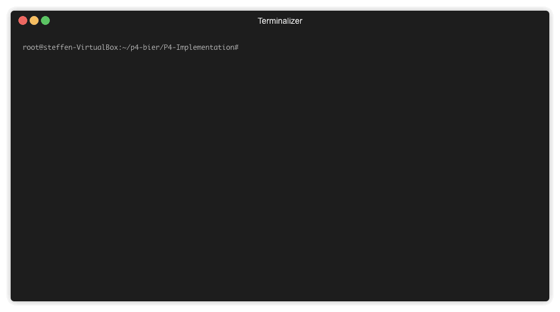

# P4-BIER

This repository contains the P4 based implementation of BIER(-FRR) including the distributed control plane.

* Install: Contains the installation script, which installs all required dependencies.
* Controller-Implementation: Contains the Python implementation of the global Controller.
* Local-Controller: Contains the Python implementation of the local controller. 
* P4-Implementation: Contains the data plane implementation of BIER(-FRR) in P4.
* protos: Contains the protobuf defintion for the communication between local and global controller. 

## Installation

Inside the `Install` folder, run `./setup.sh`. This will install all required dependencies. The installation process has been verified for Ubuntu 18.0.4.2 LTS.

## Usage

### Start a mininet topology

To start a mininet topology, go inside the `P4-Implementation` folder and run `make run TOP=XXX` where `XXX` is the desired topology, e.g. `BIER/simple`. The corresponding local controllers are automatically started.

### Start the global controller 

When the mininet topology has started, the global controller can be started. To that end, go inside the `Controller-Implementation` folder and run `./controller --config ../P4-Implementation/examples/XXX/config.json` where `XXX` is the previously started topology. The configuration file contains the grpc ports of the p4 switches and the configuration for the global controller, e.g. if node protection should be used.

### Start the host cli

When the mininet topology has started, a xterm session for the hosts can be invoked. Inside the mininet cli type `xterm h1` to start a xterm session for the host h1. Inside the xterm session, type `./host_cli/main.py` to open the host cli. The host cli features several functions, e.g. the (un-)subscription of multicast groups or to send a packet to a given ip address.

## Documentation

A documentation for the data plane implementation can be found in the repository wiki.

